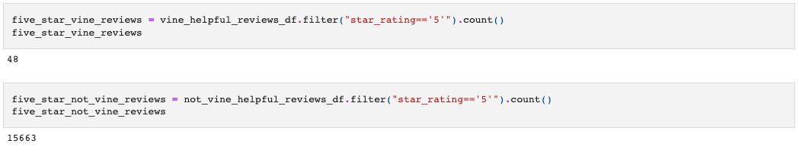

# Amazon_Vine_Analysis

## Overview of the analysis: 
The purpose of this project was to familiarize myself with Spark. Apache Spark is a unified analytics engine for large-sacale data processing. This means that when working with big data, Spark is one of the best technologies out there to use because of its in-memory computation instead of disk-based solution. It allows for lazy evaluation and delaying expressions or commands until its needed.

## Results:
The first step was to extract the dataset from an AWS S3 using PySpark in order to transform it and load it to AWS again. Please refer to [Amazon_Reviews_ETL.ipynb](https://github.com/sharof17/Amazon_Vine_Analysis/blob/main/Amazon_Reviews_ETL.ipynb) to see the code.

### - How many Vine reviews and non-Vine reviews were there?

There are 94 Vine reviews and 40,471 non-Vine reviews.

### - How many Vine reviews were 5 stars? How many non-Vine reviews were 5 stars?

48 Vine reviews and 15663 non-Vine reviews were five stars.

### - What percentage of Vine reviews were 5 stars? What percentage of non-Vine reviews were 5 stars?

51.16% of Vine reviews and 38.71% non-Vine reviews are five stars.

## Summary: 
In summary, it is important to state that 51% of the reviews in the Vine program were 5 stars reviews whereas the percentage in the non-Vine reviews is only 39%. This means that there is positivity bias for reviews in the Vine program.
Additionally we could analyse the statistical distribution (mean, median and mode) of the star rating for the Vine and non-Vine reviews.
